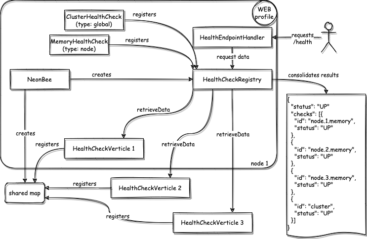

# Health

NeonBee provides an extendable API for system health monitoring. The overall health of NeonBee is determined by a set of individual health checks. These checks consist of NeonBee *built-in checks* and *custom checks* that can be provided by a user. All built-in checks are enabled by default, but can be disabled via the `NeonBeeConfig` or in the health-check specific [config](#configuration). The results of the health check procedures are published via a health endpoint.

## Architecture



- **`HealthCheckRegistry`**: is instantiated once and added to the `NeonBee` instance during the boot phase. All health checks that implement the `HealthChecks` interface, can be registered to this registry. It provides a `collectHealthCheckResults()` method which *collects data* from all `HealthCheckVerticle`s that are deployed at the time of the request, *consolidates* the retrieved results, and *returns* the consolidated health check result.
- **`HealthCheckVerticle`**: extends a `DataVerticle` and implements the  `retrieveData(...)` method which invokes all health checks that are registered to the (local) `HealthCheckRegistry` and returns the result of all (local) checks. Subsequent requests will return the cached result of the last check if the time difference to the last request which invoked a check is smaller than the configured `retention` time.
- **`HealthEndpointHandler`**: handles requests to the `health` endpoint, and requests data from the `HealthCheckRegistry`.

## Configuration

Health checks can be configured in multiple ways. [Global settings](#global-settings-via-neonbeeconfig) apply to *all* checks and can be used to enable / disable all health checks. [Health check specific settings](#health-check-specific-settings-via-config-file-on-health-check-level) on the other hand, apply only to a *single* health check. The precedence order is always; health check specific settings overwrite the global.

### Global settings via NeonBeeConfig

Global settings can be specified on the `health` property in the NeonBeeConfig (i.e., `io.neonbee.NeonBee.yaml`).

| property         | type      | description                                                                                             |
| ---------------- | --------- | ------------------------------------------------------------------------------------------------------- |
| `health.enabled` | `boolean` | Whether health checks should be globally enabled. Can be overridden by any node-specific configuration. |
| `health.timeout` | `int`     | Global timeout (in seconds) for each health check procedure.                                            |

### Health Check specific settings

Health check specific settings can be applied by adding config files that satisfy the following criteria:

- file must be placed in NeonBee's config folder (default: `config`)
- file name must equal exactly the fully qualified class name of the health check and end with either `.yaml`, `.yml`, or `.json`
- file must contain either valid json or yaml

File name (example): `/config/io.neonbee.health.CustomHealthCheck.yaml`

| property         | type      | description                                      |
| ---------------- | --------- | ------------------------------------------------ |
| `config.enabled` | `boolean` | Whether a health check should be enabled or not. |

**Note:** The config may contain health check specific configuration that is specific to a health check.

NeonBee built-in checks have the following configuration options:

| class name                    | type   | property                      | default | description                                                                              |
|-------------------------------|--------|-------------------------------|---------|------------------------------------------------------------------------------------------|
| `MemoryHealthCheck`           | node   | `criticalThresholdPercentage` | 90      | Criticality ratio of the used / max memory in percentage.                                |
| `HazelcastClusterHealthCheck` | global | `expectedClusterSize`         | -       | The expected cluster size that must match the actual size. Is checked only if specified. |
| `EventLoopHealthCheck`        | node   | `criticalEventLoopSize`       | 5       | Number of pending tasks that are allowed per event loop before check becomes unhealthy.  |

## Register Custom Checks

NeonBee allows access to its health check registry. Besides NeonBee's own checks that are registered by default, a user is able to register additional health checks. This can be done in multiple ways as described in the following sections.

### Register / Unregister checks programmatically to the health check registry

You can create your own health check that extends `AbstractHealthCheck` and register it on the registry:

```java
NeonBee neonBee = NeonBee.get(vertx)
AbstractHealthCheck myHealthCheck = new AbstractHealthCheck(neonBee) {

    @Override
    public String getId() {
        return "my-health-check";
    }

    @Override
    public boolean isGlobal() {
        return true;
    }

    @Override
    protected Function<NeonBee, Handler<Promise<Status>>> createProcedure() {
        return nb -> promise -> promise.complete(new Status().setOK()).setData(new JsonObject());
    }
};
HealthCheckRegistry registry = neonBee.getHealthCheckRegistry();
registry.register(myHealthCheck);
```

In order to unregister a health check from the registry you can either pass the name of the health check:

```java
registry.unregister("my-health-check");
```

or the health check instance itself:

```java
registry.unregister(myHealthCheck);
```

### Register checks via the Service Provider Interface

In order to register custom health checks, it is also possible to implement the Service Provider Interface `HealthCheckProvider` and NeonBee detects the provided checks automatically.

**Example:**

```java
public class CustomHealthChecks implements HealthCheckProvider {

    @Override
    public List<AbstractHealthCheck> get(Vertx vertx) {
        return List.of(new DatabaseHealthCheck(NeonBee.get(vertx)));
    }
}
```

where `DatabaseHealthCheck` refers to a user-provided class that extends `AbstractHealthCheck` (see example above).

NeonBee tries to load all classes implementing the `HealthCheckProvider` interface.
Adding a file `resources/META-INF/services/io.neonbee.HealthCheckRegistry` with
the fully qualified class name of `DatabaseHealthCheck` will add the custom health
check to NeonBee's health check registry.

## Health Endpoint

If not disabled, the health endpoint is exposed in NeonBee at the `/health` route by default.

```console
GET /health
```

Returns HTTP status code:

- "**200** ok", when the health state is `UP`,
- "**204** no content", when no checks are registered,
- "**503** service unavailable", when one or more health checks are in `DOWN` state,
- "**500** internal server error", in case of any other error.

The `HealthEndpoint` can be changed like any other endpoint of NeonBee in the config of the `ServerVerticle`.

For example:

```yaml
config:
  port: 8080
  endpoints:
    - type: io.neonbee.endpoint.health.HealthEndpoint
      enabled: true
      basePath: /healthz/
      authenticationChain: []
```

would expose the health information at the route `/healthz` without any authentication required.
