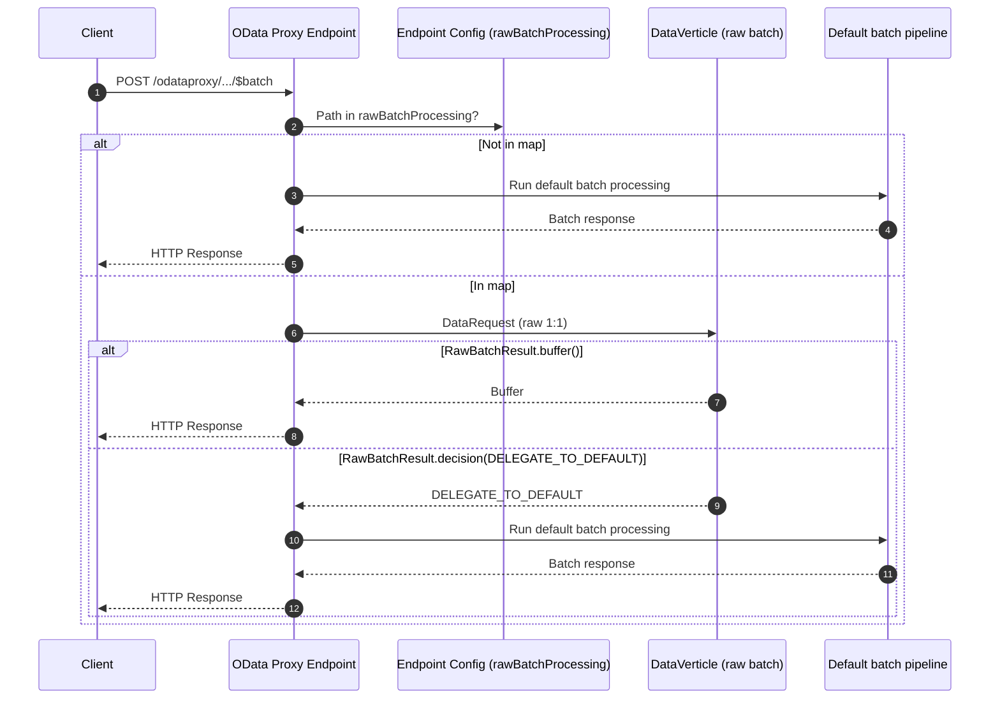

# OData and OData Proxy Request Flow

This document describes the request flow for **OData** (`/odata/`) and **OData Proxy** (`/odataproxy/`) endpoints in NeonBee.

## Overview


| Aspect              | OData (`/odata/`)                                  | OData Proxy (`/odataproxy/`)                     |
| ------------------- | -------------------------------------------------- | ------------------------------------------------ |
| **Base path**       | `/odata/`                                          | `/odataproxy/`                                   |
| **Model filter**    | `@neonbee.endpoint: odata` (default)               | `@neonbee.endpoint: odataproxy`                  |
| **Request handler** | `OlingoEndpointHandler`                            | `ODataProxyEndpointHandler`                      |
| **Parsing**         | Apache Olingo (full URI/body parsing)              | Olingo for request mapping only                  |
| **Data call**       | `EntityVerticle.requestEntity(EntityWrapper)`      | `AbstractEntityVerticle.requestEntity(Buffer)`   |
| **Response**        | Olingo serializes `EntityWrapper` → OData JSON/XML | Verticle returns raw `Buffer` → sent as response |


---

## OData request flow (`/odata/`)

1. **Route**: Request hits `ODataV4Endpoint` → route matches `/odata/<service>/`* (from EDMX models with `@neonbee.endpoint: odata`).
2. **Handler**: `OlingoEndpointHandler` maps the request to an `ODataRequest`, then Olingo’s raw handler runs (EntityProcessor, BatchProcessor, etc.) and dispatches by URI.
3. **Data**: Processor calls `EntityVerticle.requestEntity(EntityWrapper.class, ...)` → event bus → `DataVerticle.retrieveData()` returns `EntityWrapper`.
4. **Response**: Olingo serializes the `EntityWrapper` to OData JSON/XML and sends the HTTP response.

So `/odata/` is **Olingo end-to-end**: parsing, dispatching, and serialization are done by Apache Olingo; verticles only provide entity data.

---

## OData Proxy request flow (`/odataproxy/`)

1. **Route**: Request hits `ODataProxyEndpoint` → route matches `/odataproxy/<service>/`* (models with `@neonbee.endpoint: odataproxy`).
2. **Handler**: `ODataProxyEndpointHandler` checks path:
  - **$metadata / service document** → Olingo generates metadata; response is written and done.
  - **Entity request** (GET/POST/PATCH/DELETE on entity) → map to `DataQuery`, call `AbstractEntityVerticle.requestEntity(Buffer.class, ...)` → verticle returns raw `Buffer` → sent as response body.
  - **Batch request** (POST `.../$batch`) → see [Raw batch processing](#raw-batch-processing-odata-proxy-only) if configured; otherwise default batch: parse parts, run each via entity flow, build multipart response.
3. **Data**: Verticle is resolved by full qualified name; `DataVerticle.retrieveData()` (or `createData()` for batch) returns a `Buffer`. No Olingo serialization—verticle is responsible for the response body.

So `/odataproxy/` uses Olingo only for **request mapping and metadata**; entity and batch bodies are **raw buffers** from verticles.

---

## Raw batch processing (OData Proxy only)

This section describes the **new raw batch processing** for the **OData Proxy** endpoint (`/odataproxy/`). It allows selected services to have their `$batch` requests handled by a dedicated DataVerticle instead of the default batch pipeline (parse, decompose, forward to entity verticles). Only POST requests to `.../$batch` under `/odataproxy/` are affected.

### Configuration

- **Scope**: OData Proxy endpoint config only (see [ServerVerticle](verticles/ServerVerticle.md)). Other endpoints (e.g. `/odata/`) are unchanged.
- **Parameter**: `rawBatchProcessing` — an optional **map** for `/odataproxy/` only. Key: full request path (e.g. `/odataproxy/customerengagement/ContactSet/$batch`) or schema namespace (dot or slash form). Value: DataVerticle qualified name (e.g. `test/_RawBatchVerticle`).

Example (ServerVerticle endpoint config):

```yaml
# provides the odataproxy endpoint
- type: io.neonbee.endpoint.odatav4.ODataProxyEndpoint
  # enable the odataproxy endpoint, defaults to true
  enabled: true
  # the base path to map this endpoint to, defaults to /odataproxy/
  basePath: /odataproxy/
  # endpoint specific authentication chain, defaults to null and using the default authentication chain
  authenticationChain: []
  # namespace and service name URI mapping (STRICT, or LOOSE based on CDS)
  uriConversion: LOOSE
  rawBatchProcessing:
    "/odataproxy/customerengagement/ContactSet/$batch": "test/_RawBatchVerticle"
    "/odataproxy/customerengagement/SolutionVHSet/$batch": "test/_RawBatchDelegateVerticle"
```

Alternative key style using schema namespace only (one verticle per service):

```yaml
  rawBatchProcessing:
    "example/Birds": "example/_BirdsVerticle"
    "my.service/Orders": "my.service/_OrdersBatchVerticle"
```

### Behavior when a $batch request matches rawBatchProcessing

(Applies only to `/odataproxy/`.)

1. **Interception**: POST to `.../$batch` with path or service in `rawBatchProcessing` → framework does **not** run normal batch parsing or decomposition.
2. **Single data request**: The HTTP request is forwarded 1:1 to the mapped DataVerticle via one `DataRequest` (same pattern as the [raw endpoint](raw-endpoint.md)).
3. **Response**: The DataVerticle returns `**RawBatchResult`**: either a buffer (sent to client) or a `**RawBatchDecision**` (delegate to default batch or handled).

### RawBatchResult and RawBatchDecision

(Used only by raw batch verticles for `/odataproxy/`.) Verticles must extend `DataVerticle<RawBatchResult>` and return from `createData` (POST $batch) or `retrieveData`:

- `**RawBatchResult.buffer(Buffer)**` — response body is sent to the client (status/headers from `DataContext.responseData()` if set).
- `**RawBatchResult.decision(RawBatchDecision.HANDLED_RAW)**` — verticle already wrote the response; endpoint does nothing further.
- `**RawBatchResult.decision(RawBatchDecision.DELEGATE_TO_DEFAULT)**` — endpoint runs the default OData Proxy batch handler (parse, decompose, forward to entity verticles).

The endpoint keeps ownership of `RoutingContext` and response lifecycle.

### Example: Raw batch verticles (/odataproxy/)

Register the verticle qualified name (e.g. `test/_RawBatchVerticle`) under `rawBatchProcessing` in the OData Proxy endpoint config. Verticles must be `DataVerticle<RawBatchResult>` and return `RawBatchResult.buffer(...)` or `RawBatchResult.decision(...)`.

**Verticle that returns a fixed buffer (raw handling):**

```java
import io.neonbee.NeonBeeDeployable;
import io.neonbee.data.DataContext;
import io.neonbee.data.DataQuery;
import io.neonbee.data.DataVerticle;
import io.neonbee.endpoint.odatav4.rawbatch.RawBatchResult;
import io.vertx.core.Future;
import io.vertx.core.buffer.Buffer;

import static io.vertx.core.Future.succeededFuture;

@NeonBeeDeployable(namespace = "test", autoDeploy = true)
public class RawBatchEchoVerticle extends DataVerticle<RawBatchResult> {
    static final String RESPONSE_BODY = "raw-batch-response";

    @Override
    public String getName() {
        return "_RawBatchVerticle";
    }

    @Override
    public Future<RawBatchResult> createData(DataQuery query, DataContext context) {
        context.responseData().put(DataContext.STATUS_CODE_HINT, 200);
        return succeededFuture(RawBatchResult.buffer(Buffer.buffer(RESPONSE_BODY)));
    }
}
```

**Verticle that delegates to default ODataProxy batch processing:**

```java
import io.neonbee.NeonBeeDeployable;
import io.neonbee.data.DataContext;
import io.neonbee.data.DataQuery;
import io.neonbee.data.DataVerticle;
import io.neonbee.endpoint.odatav4.rawbatch.RawBatchDecision;
import io.neonbee.endpoint.odatav4.rawbatch.RawBatchResult;
import io.vertx.core.Future;

import static io.vertx.core.Future.succeededFuture;

@NeonBeeDeployable(namespace = "test", autoDeploy = true)
public class RawBatchDelegateDefaultVerticle extends DataVerticle<RawBatchResult> {

    @Override
    public String getName() {
        return "_RawBatchDelegateVerticle";
    }

    @Override
    public Future<RawBatchResult> createData(DataQuery query, DataContext context) {
        return succeededFuture(RawBatchResult.decision(RawBatchDecision.DELEGATE_TO_DEFAULT));
    }
}
```

The same verticle can choose per request: return `RawBatchResult.buffer(...)` for some cases and `RawBatchResult.decision(RawBatchDecision.DELEGATE_TO_DEFAULT)` for others.

### Flow summary (raw batch on /odataproxy/)

```
POST /odataproxy/.../$batch → path/service in rawBatchProcessing map
    → skip default batch parsing
    → one DataRequest to mapped DataVerticle (raw-endpoint style)
    → DataVerticle.createData(...) returns RawBatchResult
        - RawBatchResult.buffer(...)     → endpoint sends buffer as response
        - RawBatchResult.decision(HANDLED_RAW)            → endpoint treats as handled
        - RawBatchResult.decision(DELEGATE_TO_DEFAULT)   → endpoint runs default OData Proxy batch handler
```

**Conceptual sequence (general flow only):**




